<h1>EfficientDet-AutoAnnotation-Tool (Updated:2022/05/20)</h1>

This is an experimental project to develop EfficientDet-AutoAnnotation-Tool(EAAT). 
This tool is based on a finetuningmodel of <a href="https://github.com/google/automl/tree/master/efficientdet">google/automl/efficientdet</a> for object detection task. 
For that kind of task, we have to collect a set of enough images of a specific domain,
and create annotation files for those images, which define boundning boxes(bboxes) and labels for each object in each images.
Ordinally, that annotation task may need a lot of time, because the tedious mouse operations to define bboxes may be needed with your own hands.
 
We would like to reduce the cost and time of annotation task for object detection,
by developing AutoAnnotation Tool based on <a href="https://github.com/google/automl/tree/master/efficientdet">EfficientDet inference engine</a>.
More precisely speaking, this is a semi autoannotation tool, not a complete autoannotation tool without a GUI based annotation tool. 
<b>Workflow of EfficientDet-AutoAnnotation-Tool</b>. 
1. Prepare an images dataset of any specific domain which you are interested in. 
2. Create an annotated images dataset by using any GUI based annotation tool. 
3, Train your own efficientdet model by feeding the annotated dataset to a pretrained efficientdet-finetuning model. 
4. Detect the objects in some unannotated images of the same domain by using your own trained efficientdet model. 
5. Save the bounding boxes and labels for the detected objects as your own autoanntotation files. 
 
 To clarify explanation, we apply EfficientDet AutoAnnotation Tool to an images dataset of Pedestrian and Traffic Signals, because it is easy to collect and the number of classes of the Signals dataset is small, at most only five.
 
 
<a href="#1">STEP I: Pretrain Model</a> 
<a href="#1,1">1.1. Clone repository</a> 
<a href="#1.2">1.2. Create a project</a> 
<a href="#1.3">1,3. Create an image dataset</a> 
<a href="#1.3.1">1.3.1 Create a class definition file</a> 
<a href="#1.3.2">1.3.2 Prepare an images dataset</a> 
<a href="#1.3.3">1.3.3 Create a YOLO master dataset</a> 
<a href="#1.3.4">1.3.4 Split the YOLO master dataset</a> 
<a href="#1,3.5">1.3.5 Create a TFRecord dataset</a> 
<a href="#1.4">1.4. Pretrain an efficientdet model</a> 
<a href="#1.5">1.5. Creat a saved model</a> 
 
<a href="#2">STEP II: Apply AutoAnnotation Tool</a> 
<a href="#2.1">2.1 Prepare a new images dataset</a> 
<a href="#2.2">2.2 Apply the autoannotation tool</a> 
<a href="#2.3">2.3 Convert YOLO to TFRecords</a> 
 
<a href="#2">STEP III: Retrain Model</a> 
<a href="#3">3 Retrain Model</a> 
<a href="#3.1">3.1 Retrain efficientdet model</a> 
<a href="#3.2">3.2 Create a retrained saved model</a> 
<a href="#3.3">3.3 Infer by retrained saved model</a> 

 

<h2><a name="I">STEP I: Pretrain Model</a></h2>

<h2><a name="1.1">1.1 Clone repository</a></h2>

We use Python3.8 and tensorflow 2.4 on Windows11 to develop this EfficientDet-AutoAnnotation-Tool(EAAT).
Please create a virtual envrionment of Python3.8, and install python packages by running the following command. 
<pre>
pip install -r requirments.txt
</pre>
Pleaes clone this repository to your local PC. 
<pre>
git clone https://github.com/atlan-antillia/EfficientDet-AutoAnnotation-Tool.git
</pre>

The main source code of this repository is based on google/automl/efficientdet.
We use the efficientdet-d0 pretraiend model to train a custom dataset,

<h2><a name="1.2">1.2. Create a project</a></h2>
As an simple example, we create a project <b>Signals</b> which contains a images dataset of pedestrian and traffic signals. 
Please run <a href="./ProjectCreator.py">ProjectCreator.py</a> in your local repository. 
Usage:
<pre>
python ProjectCreator.py dataset_name project_name image_size num_classes
</pre>
Please run the following command to create a project <b>Signals</b>:
<pre>
python ProjectCreator.py jp_signals Signals 512x512 5
</pre>
, where
<pre>
 dataset_name:   jp_signals
 project_name:   Signals
 image_size:     512x512
 num_classes:    5
</pre>
The image size 512x512 is a recommended size for efficientdet-d0 pretrained model. 
This command will generate ./projects/Signals and ./projects/Signals/configs folders, and the following bat files under ./projects/Signals
folder.
<pre>
./projects/
  +- Signals/
    +- 1_create_pretrained_model.bat
    +- 1.1_pretrain_yolo_master_splitter.bat
    +- 1.2_pretrain_yolo2tfrecord_converter.bat
    +- 1.3_pretrain.bat
    +- 1.4_pretrain_create_saved_model.bat
    +- 2_create_autoannotated_dataset.bat
    +- 2.2_apply_autoannotator.bat
    +- 2.3_autoannotated_yolo2tfrecord_converter.bat
    +- 3_create_retrained_model.bat
    +- 3.1_retrain.bat
    +- 3.2_retrain_create_saved_model.bat
    +- 3.3_retrained_inference.bat
    +- pretrain_tfrecord_inspect.bat
    +- retrain_tfrecord_inspect.bat

</pre>
,and conf files.
<pre>
./projects/
  +- Signals/
    +- configs/
      +- autoannotated_yolo2tfrecord_converter.conf
      +- pretrain_yolo2tfrecord_converter.conf

</pre>

<h2><a name="1.3">1.3. Create an image dataset</a></h2>
Please collect a minimum set of signals images, and create YOLO annotatation files to those images by using any GUI annotation tool. 

<h3><a name="1.3.1">1,3.1 Create a class definition file</a></h3>
Please create classes.txt file to define classes(labels) for the signals dataset under Signals folder.
<pre>
./projects/
   +- Signals/
     +- classes.txt
</pre>
     
The classes.txt file will contain the following 5 classes: 
<pre>
Pedestrian_Signal_Blue
Pedestrian_Signal_Red
Traffic_Signal_Blue
Traffic_Signal_Red
Traffic_Signal_Yellow
</pre>

Sample Signals: 
<table>
<tr>
<td>Pedestrian_Signal_Blue 

</td>
<td>Pedestrian_Signal_Red 

</td>
<td>Traffic_Signal_Blue 
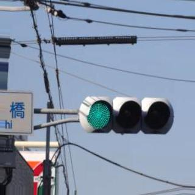
</td>
</tr>
<tr>
<td>Traffic_Signal_Red 
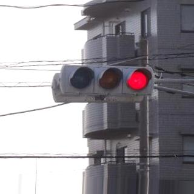
</td>
<td>Traffic_Signal_Yellow 

</td>
</tr>
</table>
 
<h3><a name="1.3.2">1.3.2 Prepare an images dataset</a></h3>
Please collect a minmum dataset of signals images, which must be enough number of images,
 probably several dozen images will be needed for each class. 
Please resize those images to be the same size 512x512, and copy the resized images files to 
<b>pretrain_yolo/master folder</b>, and also <b>classes.txt</b> to that folder as shown below. 

<pre>
./prjects/
  +- Signals/
    +- pretrain_yolo/
      +- master/
        +- classes.txt
        +- images*.jpg
        ...
</pre>

 
<h3><a name="1.3.3">1.3.3 Create a YOLO master dataset</a></h3>
Please create YOLO annotation files(*.txt) for the images under <b>pretrain_yolo/master</b> folder by using any GUI annotation tool. 
Input: yolo master unannotated dataset
<pre>
 ./projects/
   +- Signals/
     +- pretrain_yolo/
       +- master/
         +- classes.txt
         +- image*.jpg
         ...
</pre>
Output: yolo master annotated dataset
<pre>
 ./projects/
   +- Signals/
     +- pretrain_yolo
       +- master/
         +- classes.txt
         +- image*.jpg
         +- image*.txt
         ...
</pre>

<h3><a name="1.3.4">1.3.4 Split the YOLO master dataset</a></h3>
Please change directory to ./projects/Signals, and run the following bat file to split the YOLO master dataset to train and valid.
<pre>
1.1_pretrain_yolo_master_splitter.bat
</pre>
, which is the following:
<pre>
rem 1.1_pretrain_yolo_master_splitter.bat
python ../../YOLOMasterDatasetSplitter.py ^
  ./pretrain_yolo/master ^
  ./pretrain_yolo/train ^
  ./pretrain_yolo/valid
</pre>

Input: yolo master dataset
<pre>
 ./projects/
   +- Signals/
     +- pretrain_yolo
       +- master/
         +- classe.txt
         +- image*.jpg
         +- image*.txt
         ...
</pre>
Output: yolo train and valid dataset
<pre>
 ./projects/
   +- Signals/
     +- pretrain_yolo
       +- train/
         +- classe.txt
         +- image*.jpg
         +- image*.txt
         ...
       +- valid/
         +- classe.txt
         +- image*.jpg
         +- image*.txt
         ...
</pre>
         
<h3><a name="1.3.5">1.3.5 Create a TFRecord dataset</a></h3>
We use a finetuning model of pretrained model(efficientdet-d0) of google/automl/efficientdet to train our efficientdet signals 
model, so we have to create a signals tfrecord dataset from the pretrain yolo dataset.  
At ./projects/Signals directory directory, please run the following bat file to convert YOLO to TFRecord. 
<pre>
1.2_pretrain_yolo2tfrecord_converter.bat
</pre>
, which is the following:
<pre>
rem 1.2_pretrain_yolo2tfrecord_converter.bat
python ../../annotation_converters/YOLO2TFRecordConverter.py ^
  ./configs/pretrain_yolo2tfrecord_converter.conf
</pre>

Input: pretrain_yolo train and valid 
<pre>
 ./projects/
   +- Signals/
     +- pretrain_yolo
       +- train/
         ...
       +- valid/
         ...
</pre>
Output: pretrain_tfrecod train and valid 
<pre>
 ./projects/
   +- Signals/
     +-pretrain_tfrecords/
       +-train/
         train.tfrecord  
       +-valid/
         valid.tfrecord
     +- label_map.pbtxt
     +- label_map.yaml
</pre> 
 
Please run the following bat file to inspect the pretrain_tfrecords/train.
<pre>
./pretrain_tfrecord_inspect.bat
</pre>
  
tfrecord_inspector_objects_count: 
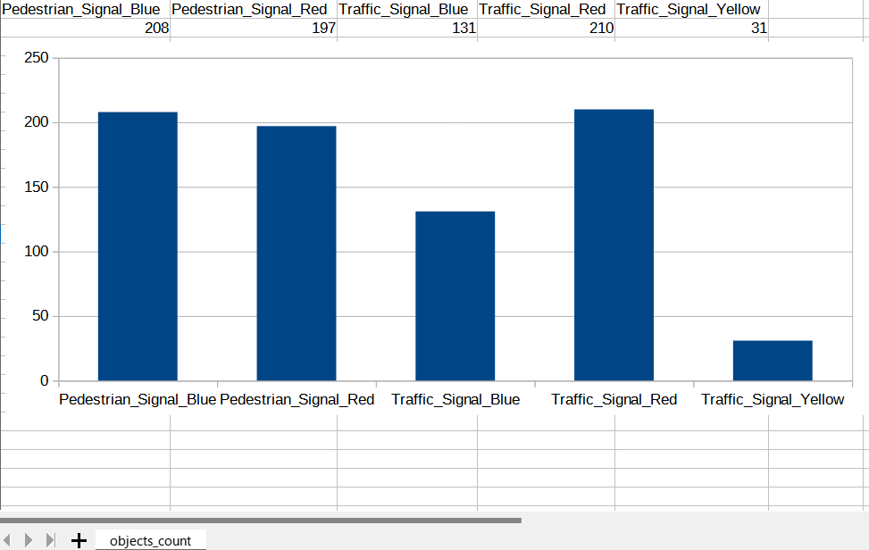<> 
tfrecord_inspector_train sample image: 
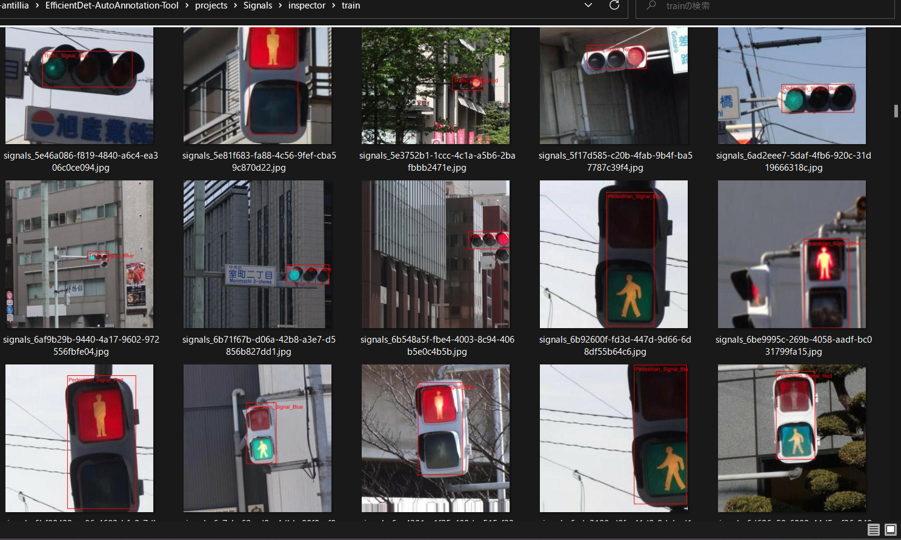<> 

<h3><a name="1.4">1.4. Pretrain an efficientdet model</a></h3>
Please download pretrained model efficientdet-d0 for the original coco efficientdet model from 
https://storage.googleapis.com/cloud-tpu-checkpoints/efficientdet/coco2/efficientdet-d0.tar.gz
, and expand it at your local repository. 
 
See also: https://github.com/google/automl/tree/master/efficientdet 
 
Please run the following bat file to train efficientdet signals model by using pretrain_tfrecord dataset. 
<pre>
1.3_pretrain.bat
</pre>
, which is the following:
<pre>
rem 1.3_pretrain.bat
python ../../ModelTrainer.py ^
  --mode=train_and_eval ^
  --train_file_pattern=./pretrain_tfrecords/train/*.tfrecord  ^
  --val_file_pattern=./pretrain_tfrecords/valid/*.tfrecord ^
  --model_name=efficientdet-d0 ^
  --hparams="input_rand_hflip=False,image_size=512x512,num_classes=5,label_map=./label_map.yaml" ^
  --model_dir=./pretrained_models ^
  --label_map_pbtxt=./label_map.pbtxt ^
  --eval_dir=./pretrain_eval ^
  --ckpt=../../efficientdet-d0  ^
  --train_batch_size=4 ^
  --early_stopping=map ^
  --patience=10 ^
  --eval_batch_size=1 ^
  --eval_samples=400  ^
  --num_examples_per_epoch=800 ^
  --num_epochs=100
</pre>

Input: pretrain_tfrecords
<pre>
 ./projects/
   +- Signals/
     +-pretrain_tfrecords/
       +- train/
         ...
       +- valid/
         ...
</pre>
Output: pretrained_model 
<pre>
 ./projects/
   +- Signals/
     +- pretrained_models/
        +- ckpt.*
</pre>
    
ModelTraining console output: 
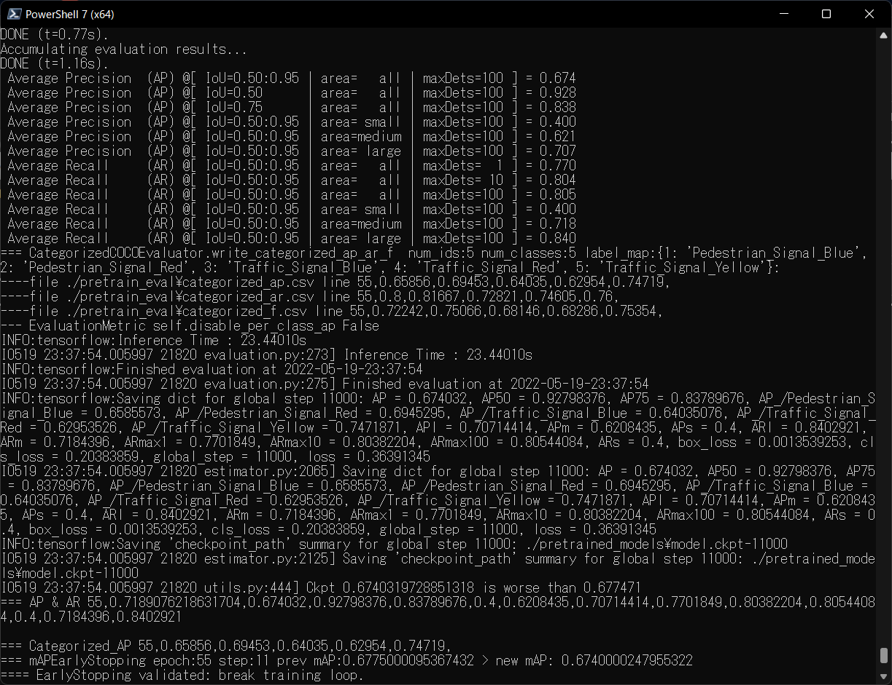 
 
COCO metrics: 
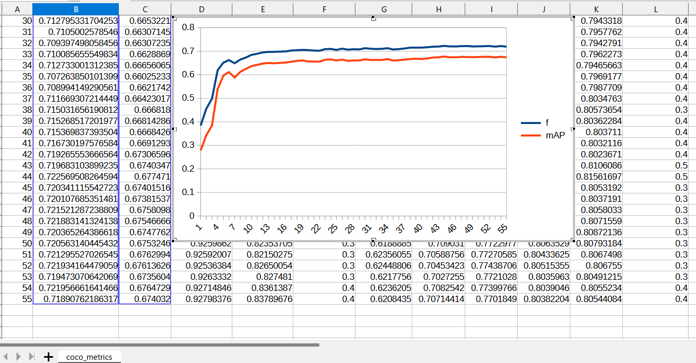 
 
Training loss : 
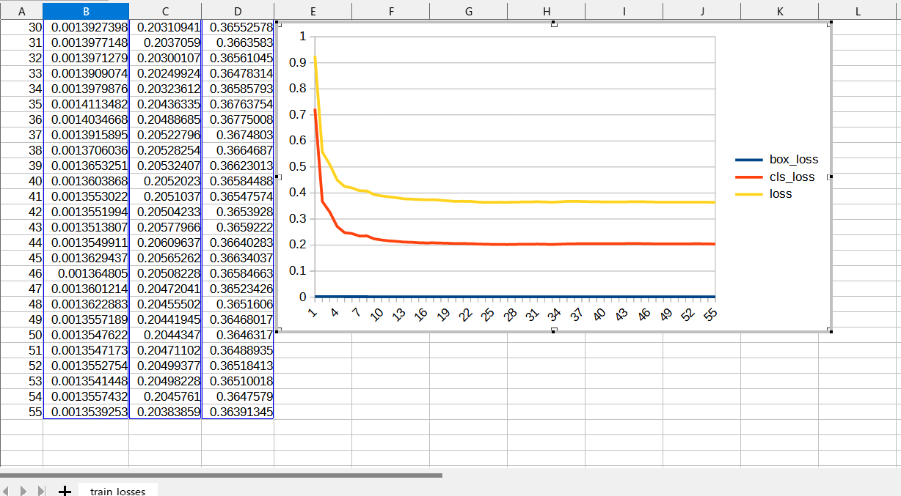 
 

<h3><a name="1.5">1.5. Creat a saved model</a></h3>
Please run the following bat file to create a saved_model from the pretrained model just created by above command. 
<pre>
1.4_pretrain_create_saved_model.bat
</pre>
, which is the following:
<pre>
rem 1.4_pretrain_create_saved_model.bat
python ../../SavedModelCreator.py ^
  --runmode=saved_model ^
  --model_name=efficientdet-d0 ^
  --ckpt_path=./pretrained_models  ^
  --hparams="image_size=512x512,num_classes=5" ^
  --saved_model_dir=./pretrained_saved_model
</pre>
   
Input: pretrained_models
<pre>
 ./projects/
   +- Signals/
     +- pretrained_models/
       +- ckpt.*
   ...
</pre>
Output: pretrained_saved_model
<pre>
./projects/
  +- Signals/
    +- pretrained_saved_model/
      +- saved_mod.pb
</pre>
     
<b>ShortCut</b> 
Instead of the above four bat files, you can also run the following bat file: 
<pre>
1_create_pretrained_model.bat
</pre>
<pre>
rem 1_create_pretrained_model.bat

call 1.1_pretrain_yolo_master_splitter.bat
call 1.2_pretrain_yolo2tfrecord_converter.bat
call 1.3_pretrain.bat
call 1.4_pretrain_create_saved_model.bat
</pre>
 

<h2><a name="II">STEP II: Apply AutoAnnotation Tool</a></h2>

<h2><a name="2.1">2.1 Prepare a new images dataset</a></h2>
 Please collet new signals images to retrain the efficientdet signals model created by STEP I, and copy those images files to 
 unannotated_dataset folder. 
<pre>
./projects/
  +- Signals/
    +- unannotated_dataset
      +- images*.jpg
</pre>

<h2><a name="2.2">2.2 Apply the autoannotation tool</a></h2>
Please run the following bat file to apply the autoannotation tool to the new unannotated_dataset,
 which will detect objects in the images in unannotated_dataset and create YOLO annotation files 
 to the images.
<pre>
2.2_apply_autoannotationtor.bat
</pre>
, which is the following.
<pre>
rem 2.2_apply_annotationtor.bat
python ../../AutoAnnotator.py ^
  --runmode=saved_model_infer ^
  --model_name=efficientdet-d0 ^
  --saved_model_dir=./pretrained_saved_model ^
  --min_score_thresh=0.6 ^
  --hparams="num_classes=5,label_map=./label_map.yaml" ^
  --input_image=./unannotated_dataset/*.jpg ^
  --yolo_output_dir=./autoannotated_yolo ^
  --yolo_classes_file=./classes.txt ^
  --yolo_autoannotation=True ^
  --output_image_dir=./unannotated_dataset_output
</pre>
 
By running the command above, we are able to detect signals objects in the images in the unannotated_dataset folder, 
and get annotation information, bounding-boxes and labels, on the detected objects.
In this way, we can save such annotation information as the YOLO annotation files.
 
Input; unannotated images dataset
<pre>
./projects/
  +- Signals/
    +- unannotated_dataset/
      +- images*.jpg

</pre>
Output:YOLO annotation dataset
<pre>
./projects/
  +- Signals/
    +- autoannotated_yolo/
      +- train
        +- classes.txt
        +- image*.jpg
        +- image*.txt
        ...
      +- valid
        +- classes.txt
        +- image*.jpg
        +- image*.txt
        ...
</pre>

<h2><a name="2.3">2.3 Convert YOLO to TFRecords</a></h2>
Please run the following bat file to convert YOLO dataset to TFRecords. 
<pre>
2.3_autoannotated_yolo2tfrecord_converter.bat
</pre>
, which is the following;
<pre>
rem 2.3_autoannotated_yolo2tfrecord_converter.bat
python ../../annotation_converters/YOLO2TFRecordConverter.py ^
  ./configs/autoannotated_yolo2tfrecord_converter.conf
.conf
</pre>
,where autoannotated_yol2tfrecord_convert.conf is the following.
<pre>
; autoannotated_yolo2tfrecord_converter.conf
[configs]
version      = "2.0"

[dataset]
name         = "jp_signals"
copyright    = "antillia.com"
version      = "2.0"
classes      = "./classes.txt"

tfrecord_dir    = "./autoannotated_tfrecords"
label_map_pbtxt = "./label_map.pbtxt"
label_map_yaml  = "./label_map.yaml"

;yolos dataset
[train]
images_dir   = "./autoannotated_yolo/train"
anno_dir     = "./autoannotated_yolo/train"

[valid]
images_dir   = "./autoannotated_yolo/valid"
anno_dir     = "./autoannotated_yolo/valid"
</pre>
 
Input:autoannotated_yolo dataset
<pre>
./projects/
  +- Signals/
    +- autoannotated_yolo
      +- train
        +- classes.txt
        +- image*.jpg
        +- image*.txt
      ...
      +- valid
        +- classes.txt
        +- image*.jpg
        +- image*.txt
      ...
</pre>
Output: autoannotated_tfrecords
<pre>
./projects/
  +- Signals/
    +- autoannotated_tfrecords/
      +- train/
        +- train.tfrecord
      +- valid/
        +- train.tfrecord
</pre>

<b>ShortCut</b> 
Instead of the above two bat files, you can also run the following bat file. 
<pre>
2_create_autoannotated_dataset.bat
</pre>
<pre>
rem 2_create_autoannotated_dataset.bat

call 2.2_apply_autoannotationtor.bat
call 2.3_autoannotated_yolo2tfrecord_converter.bat
</pre>

 
<h2><a name="3">STEP III: Retrain Model</a></h2>
Now we are able to retrain the signals efficientdet model by using the autoannotated_tfrecord
 created in STEP II.

<h2><a name="3.1">3.1 Retrain efficientdet model</a></h2>
Please run the following bat file to retrain the signals efficientdet model. 
<pre>
3.1_retrain.bat
</pre>
, which is the following:
<pre>
rem 3.1_retrain.bat
rem use ckpt in ./pretraind_models generated by pretrain.bat
python ../../ModelTrainer.py ^
  --mode=train_and_eval ^
  --train_file_pattern=./autoannotated_tfrecords/train/*.tfrecord  ^
  --val_file_pattern=./autoannotated_tfrecords/valid/*.tfrecord ^
  --model_name=efficientdet-d0 ^
  --hparams="input_rand_hflip=False,image_size=512x512,num_classes=5,label_map=./label_map.yaml" ^
  --model_dir=./retrained_models ^
  --label_map_pbtxt=./label_map.pbtxt ^
  --eval_dir=./retrain_eval ^
  --ckpt=./pretrained_models  ^
  --train_batch_size=4 ^
  --early_stopping=map ^
  --patience=10 ^
  --eval_batch_size=1 ^
  --eval_samples=400  ^
  --num_examples_per_epoch=800 ^
  --num_epochs=100
</pre>
      
Input: autoannotated_tfrecord
<pre>
./projects/
  +- Signals/
    +- autoannotated_tfrecord/
      +- train/
        +- train.tfrecord
      +- valid/
        +- train.tfrecord
</pre>

Output: retrained_model
<pre>
./projects/
  +- Signals/
    +- retrained_models/
      +- model.ckpt*
        ...
</pre>
Retrain console output: 
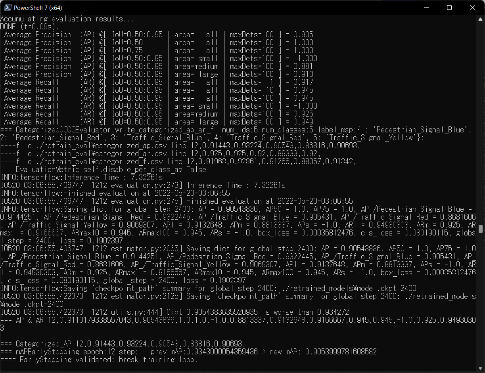 

<h2><a name="3.2">3.2 Create a retrained saved model</a></h2>
Please run the following bat file to create a retrained saved model from the retrained model. 
<pre>
3.2_retrain_create_saved_model.bat
</pre>
, which is the following:
<pre>
rem 3.2_retrain_create_saved_model.bat
python ../../SavedModelCreator.py ^
  --runmode=saved_model ^
  --model_name=efficientdet-d0 ^
  --ckpt_path=./retrained_models  ^
  --hparams="image_size=512x512,num_classes=5" ^
  --saved_model_dir=./retrained_saved_model
</pre>

Input: retrained_models
<pre>
./projects/
  +- Signals/
    +- retrained_models/
      +- ckpt.*
</pre>

Output: retrained_saved_model
<pre>
./projects/
  +- Signals/
    +- retrained_saved_model/
      +- saved_model.pb
</pre>
<b>ShortCut</b> 
Instead of the above two bat files, you can also run the following bat file. 
<pre>
3_create_retrained_model.bat
</pre>
<pre>
rem 3_create_retrained_model.bat

call 3.1_retrain.bat
call 3.2_retrain_create_saved_model.bat
</pre>

<h2><a name="3.3">3.3 Infer by retrained saved model</a></h2>
Please run the following bat file to infer objects in images of test_dataset folder by the retrained_saved_model. 
<pre>
3.3_retrained_inference.bat
</pre>
, which is the following:
<pre>
rem 3.3_retrained_inference.bat
python ../../SavedModelInferencer.py ^
  --runmode=saved_model_infer ^
  --model_name=efficientdet-d0 ^
  --saved_model_dir=./retrained_saved_model ^
  --min_score_thresh=0.4 ^
  --hparams="num_classes=5,label_map=./label_map.yaml" ^
  --input_image=./test_dataset/*.jpg ^
  --output_image_dir=./test_dataset_outputs
</pre>

Input: test images dataset
<pre>
./projects/
  +- Signals/
    +- test_dataset/
      +- image*.jpg
</pre>

Output: inference results
<pre>
./projects/
  +- Signals/
    +- test_dataset_outputs/
      +- image*.jpg
      +- image*.objects.csv
      +- image*.stats.csv
</pre>

Some inference results: 
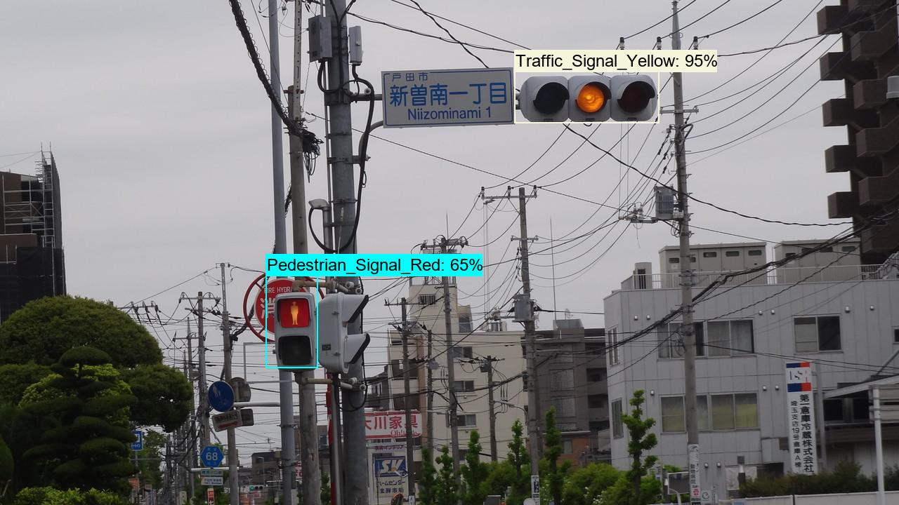 
 

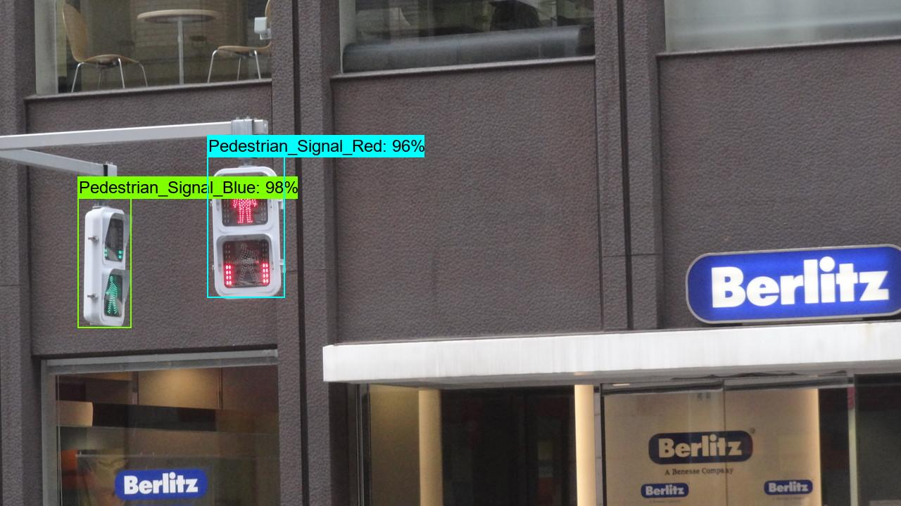 
 
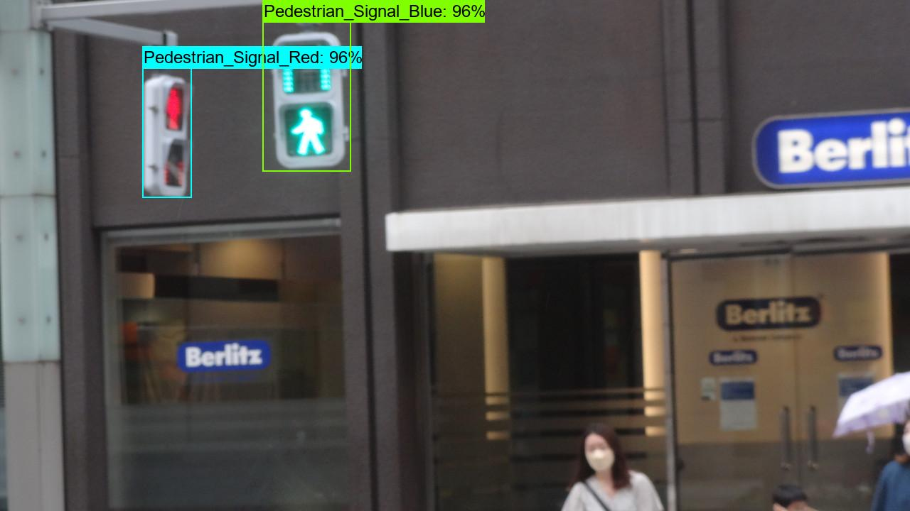 
 
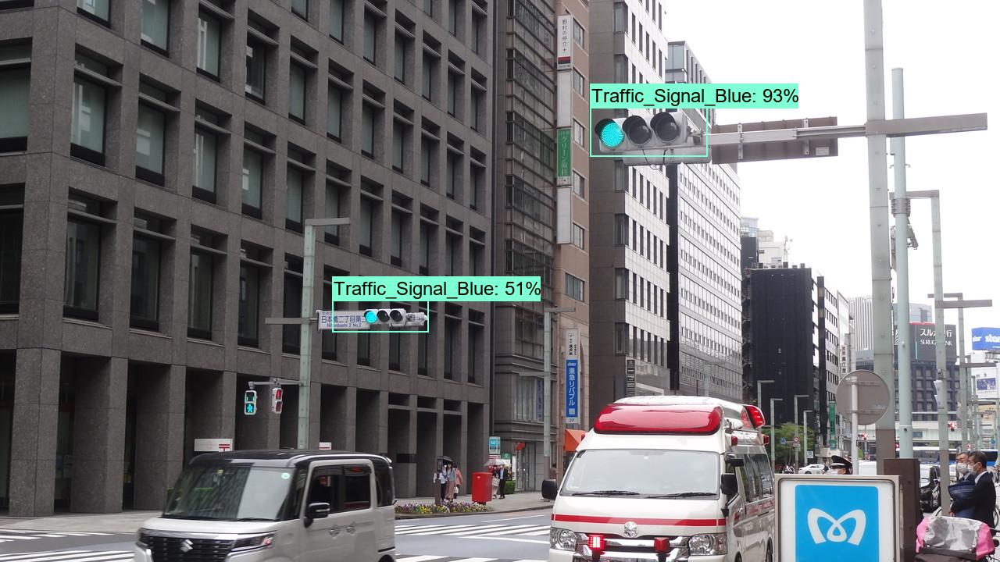 
 

 
 

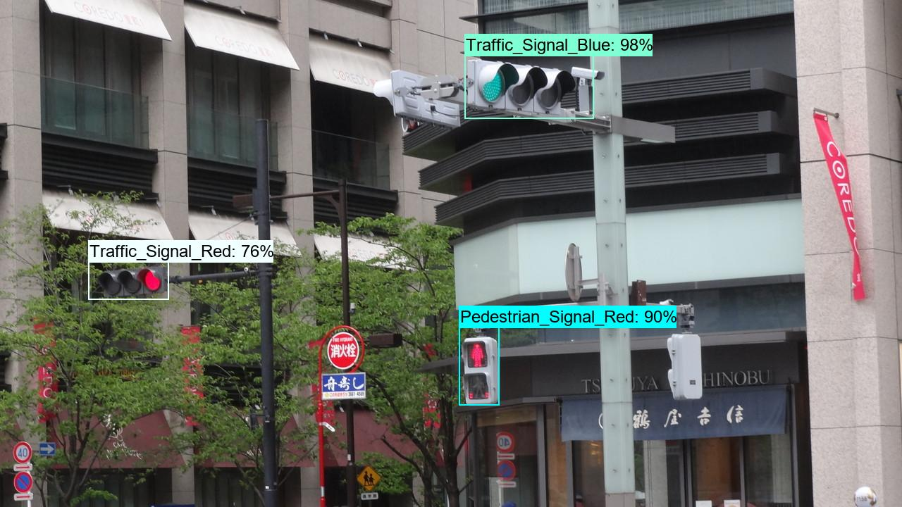 
 

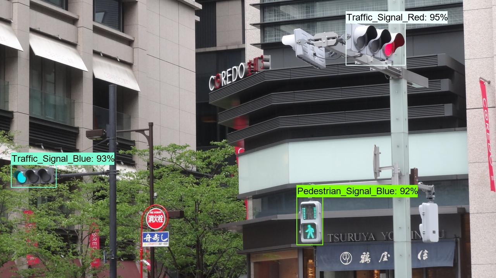 
 

